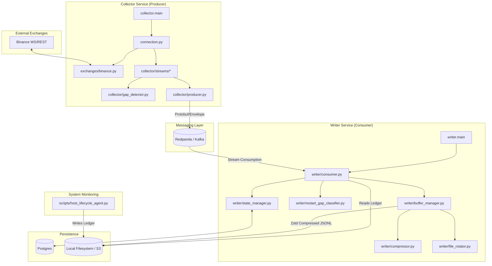

# Cryptolake Master Blueprint

This document is the single source of truth for the Cryptolake architecture. It combines high-level design, data flow diagrams, and a granular function-level usage map.

---

## 1. High-Level Data Flow

---

## 2. Component Registry

### Core Services

| Component | Path | Purpose | Key Logic | Dependencies |
| :--- | :--- | :--- | :--- | :--- |
| **Collector** | `src/collector/main.py` | Entry point for data collection. | Orchestrates WebSocket connections, data handlers, and Redpanda producers. | `connection.py`, `producer.py`, `streams/`, `StateManager` |
| **Writer** | `src/writer/main.py` | Entry point for data persistence. | Consumes messages from Redpanda, manages file rotation, and handles state. | `consumer.py`, `buffer_manager.py`, `StateManager` |

### Collector Modules

| Component | Path | Purpose | Key Logic | Dependencies |
| :--- | :--- | :--- | :--- | :--- |
| **Connection Manager** | `src/collector/connection.py` | Manages exchange connectivity. | Handles WebSocket lifecycle, reconnection, and multiplexing streams. | `BinanceAdapter`, `StreamHandler` |
| **Binance Adapter** | `src/exchanges/binance.py` | Exchange-specific API client. | Translates Binance WS/REST messages into internal formats. | `base.py` |
| **Stream Handlers** | `src/collector/streams/` | Processes specific data types. | `DepthHandler`: Manages order book snapshots/diffs. `SimpleStreamHandler`: Processes trades, tickers. | `GapDetector`, `Producer` |
| **Gap Detector** | `src/collector/gap_detector.py` | Real-time gap detection. | `DepthGapDetector`: Validates pu/u chain. `SessionSeqTracker`: Tracks in-session sequence numbers. | N/A |
| **Producer** | `src/collector/producer.py` | Sends data to Redpanda. | Buffers and batches messages to minimize Kafka overhead. | `aiokafka` |

### Writer Modules

| Component | Path | Purpose | Key Logic | Dependencies |
| :--- | :--- | :--- | :--- | :--- |
| **Consumer** | `src/writer/consumer.py` | Consumes and routes messages. | Manages Kafka offsets, classifies gaps, and routes data to buffers. | `BufferManager`, `RestartGapClassifier` |
| **State Manager** | `src/writer/state_manager.py` | Persistent state tracking. | Stores component heartbeats, maintenance intents, and last-processed sequence/offsets in Postgres. | `psycopg` (SQLAlchemy-like but async) |
| **Buffer Manager** | `src/writer/buffer_manager.py` | File I/O orchestration. | Manages per-stream buffers, triggers compression and rotation. | `Compressor`, `FileRotator` |
| **Restart Gap Classifier** | `src/writer/restart_gap_classifier.py` | Post-restart gap analysis. | Multi-phase classification using boot IDs, session IDs, and host-level evidence. | `HostLifecycleReader` |

---

## 3. Data Flow Detail

### Data Path (Normal Operation)
1. **Binance** sends a WebSocket message.
2. **Collector** receives message via `WebSocketManager`.
3. **StreamHandler** validates it (e.g., `DepthGapDetector` checks sequence).
4. **Envelope** creates a `data` message with metadata (received_at, session_seq).
5. **Producer** batches and sends to **Redpanda**.
6. **Writer Consumer** pulls message from **Redpanda**.
7. **BufferManager** writes to a stream-specific file.
8. **FileRotator** compresses (Zstd) and moves file to final storage when full/old.

---

## 4. Key Cross-Cutting Concerns

- **Maintenance Awareness:** Components check Postgres for `MaintenanceIntent` before classifying gaps as "unplanned".
- **Sequence Integrity:** `session_seq` is maintained across the entire pipeline from Collector to Storage to ensure no silent data loss.
- **Backpressure:** Collector monitors Producer buffer levels and applies backpressure to WebSocket streams if Kafka is slow.

---

## 5. Function Inventory & Usage Map

This section maps every function definition to its callers and dependencies.

## scripts/generate_inventory.py
### `analyze_codebase` (Line 6)
- **Description:** No description.
- **Used by:** (No direct internal calls found or entry point)

## scripts/host_lifecycle_agent.py
### `read_ledger_events` (Line 63)
- **Description:** Read all valid JSONL events from the ledger, discarding bad lines.
- **Used by:**
  - `prune_ledger` in `scripts/host_lifecycle_agent.py`
- **Calls:**
  - `read_jsonl`
### `append_event` (Line 68)
- **Description:** Append a single event record to the JSONL ledger.
- **Used by:**
  - `_run_event_loop` in `scripts/host_lifecycle_agent.py`
  - `record_boot_id` in `scripts/host_lifecycle_agent.py`
  - `record_maintenance_intent` in `scripts/host_lifecycle_agent.py`
- **Calls:**
  - `append_jsonl`
### `prune_ledger` (Line 78)
- **Description:** Remove events older than *max_age* (default 7 days) from the ledger.
- **Used by:**
  - `agent_startup` in `scripts/host_lifecycle_agent.py`
- **Calls:**
  - `read_ledger_events`
### `record_boot_id` (Line 119)
- **Description:** Write a ``boot_id`` event with the current host boot ID.
- **Used by:**
  - `agent_startup` in `scripts/host_lifecycle_agent.py`
- **Calls:**
  - `append_event`
  - `get_host_boot_id`
### `record_maintenance_intent` (Line 130)
- **Description:** Write a ``maintenance_intent`` event to the ledger.
- **Used by:** (No direct internal calls found or entry point)
- **Calls:**
  - `append_event`
### `_match_tracked_container` (Line 160)
- **Description:** Return the canonical tracked container name if *name* matches.
- **Used by:**
  - `parse_docker_event` in `scripts/host_lifecycle_agent.py`
### `parse_docker_event` (Line 189)
- **Description:** Parse a raw Docker engine event into a ledger record.
- **Used by:**
  - `_run_event_loop` in `scripts/host_lifecycle_agent.py`
- **Calls:**
  - `_match_tracked_container`
### `agent_startup` (Line 236)
- **Description:** Run the agent startup sequence: prune old events, record boot ID.
- **Used by:**
  - `main` in `scripts/host_lifecycle_agent.py`
- **Calls:**
  - `prune_ledger`
  - `record_boot_id`
### `_run_event_loop` (Line 248)
- **Description:** Subscribe to Docker events via the Unix socket and persist them.
- **Used by:**
  - `main` in `scripts/host_lifecycle_agent.py`
- **Calls:**
  - `__init__`
  - `append_event`
  - `connect`
  - `parse_docker_event`
### `__init__` (Line 264)
- **Description:** No description.
- **Used by:**
  - `__init__` in `scripts/host_lifecycle_agent.py`
  - `_run_event_loop` in `scripts/host_lifecycle_agent.py`
- **Calls:**
  - `__init__`
### `connect` (Line 268)
- **Description:** No description.
- **Used by:**
  - `_connection_loop` in `src/collector/connection.py`
  - `_ensure_connected` in `src/writer/state_manager.py`
  - `_init_state_manager` in `src/collector/main.py`
  - `_run_event_loop` in `scripts/host_lifecycle_agent.py`
  - `_write_intent` in `src/cli/verify.py`
  - `connect` in `scripts/host_lifecycle_agent.py`
  - `connect` in `src/writer/state_manager.py`
  - `mark_maintenance` in `src/cli/verify.py`
  - `start` in `src/writer/main.py`
- **Calls:**
  - `connect`
### `main` (Line 300)
- **Description:** Entry point for the host lifecycle agent.
- **Used by:** (No direct internal calls found or entry point)
- **Calls:**
  - `_run_event_loop`
  - `agent_startup`

## src/cli/verify.py
### `verify_checksum` (Line 25)
- **Description:** Compare SHA-256 of data file against its .sha256 sidecar.
- **Used by:**
  - `verify` in `src/cli/verify.py`
- **Calls:**
  - `compute_sha256`
### `verify_envelopes` (Line 35)
- **Description:** Validate required fields and raw_sha256 integrity for each envelope.
- **Used by:**
  - `verify` in `src/cli/verify.py`
### `check_duplicate_offsets` (Line 53)
- **Description:** Find duplicate (topic, partition, offset) tuples.
- **Used by:**
  - `verify` in `src/cli/verify.py`
- **Calls:**
  - `add`
### `report_gaps` (Line 65)
- **Description:** Return all gap envelopes from a list of envelopes.
- **Used by:**
  - `verify` in `src/cli/verify.py`
### `decompress_and_parse` (Line 70)
- **Description:** Decompress a .jsonl.zst file and parse each line as JSON.
- **Used by:**
  - `generate_manifest` in `src/cli/verify.py`
  - `verify` in `src/cli/verify.py`
### `verify_depth_replay` (Line 78)
- **Description:** Verify depth diffs are anchored by snapshots with valid pu chains.
- **Used by:**
  - `verify` in `src/cli/verify.py`
- **Calls:**
  - `_in_gap`
### `_in_gap` (Line 121)
- **Description:** No description.
- **Used by:**
  - `verify_depth_replay` in `src/cli/verify.py`
### `generate_manifest` (Line 182)
- **Description:** Generate a manifest summarizing archive contents for a date.
- **Used by:**
  - `manifest` in `src/cli/verify.py`
- **Calls:**
  - `decompress_and_parse`
### `cli` (Line 237)
- **Description:** CryptoLake data verification CLI.
- **Used by:** (No direct internal calls found or entry point)
### `verify` (Line 252)
- **Description:** Verify archive integrity for a date.
- **Used by:** (No direct internal calls found or entry point)
- **Calls:**
  - `check_duplicate_offsets`
  - `decompress_and_parse`
  - `report_gaps`
  - `verify_checksum`
  - `verify_depth_replay`
  - `verify_envelopes`
  - `write_sha256_sidecar`
### `manifest` (Line 341)
- **Description:** Generate manifest.json for a date directory.
- **Used by:** (No direct internal calls found or entry point)
- **Calls:**
  - `generate_manifest`
### `mark_maintenance` (Line 365)
- **Description:** Record a planned maintenance intent without shutting anything down.
- **Used by:** (No direct internal calls found or entry point)
- **Calls:**
  - `_write_intent`
  - `close`
  - `connect`
  - `create_maintenance_intent`
### `_write_intent` (Line 379)
- **Description:** No description.
- **Used by:**
  - `mark_maintenance` in `src/cli/verify.py`
- **Calls:**
  - `close`
  - `connect`
  - `create_maintenance_intent`

## src/collector/connection.py
### `_next_seq` (Line 54)
- **Description:** No description.
- **Used by:**
  - `_depth_resync` in `src/collector/connection.py`
  - `_emit_disconnect_gaps` in `src/collector/connection.py`
  - `_receive_loop` in `src/collector/connection.py`
### `_get_ws_urls` (Line 60)
- **Description:** Build WebSocket URLs, excluding REST-only streams.
- **Used by:**
  - `has_ws_streams` in `src/collector/connection.py`
  - `start` in `src/collector/connection.py`
- **Calls:**
  - `get_ws_urls`
### `has_ws_streams` (Line 76)
- **Description:** True if this manager is expected to open any WebSocket connections.
- **Used by:**
  - `is_connected` in `src/collector/connection.py`
- **Calls:**
  - `_get_ws_urls`
### `_connection_loop` (Line 93)
- **Description:** No description.
- **Used by:**
  - `start` in `src/collector/connection.py`
- **Calls:**
  - `_depth_resync`
  - `_emit_disconnect_gaps`
  - `_receive_loop`
  - `connect`
### `_receive_loop` (Line 135)
- **Description:** No description.
- **Used by:**
  - `_connection_loop` in `src/collector/connection.py`
- **Calls:**
  - `_next_seq`
  - `close`
  - `extract_exchange_ts`
  - `handle`
  - `poll`
  - `route_stream`
### `_depth_resync` (Line 179)
- **Description:** Depth resync flow per spec Section 7.2.
- **Used by:**
  - `_connection_loop` in `src/collector/connection.py`
  - `_on_pu_chain_break` in `src/collector/main.py`
- **Calls:**
  - `_next_seq`
  - `build_snapshot_url`
  - `create_data_envelope`
  - `emit_gap`
  - `is_healthy_for_resync`
  - `parse_snapshot_last_update_id`
  - `produce`
  - `reset`
  - `set_sync_point`
### `_emit_disconnect_gaps` (Line 251)
- **Description:** Emit gap records for all symbol/stream combos on this socket.
- **Used by:**
  - `_connection_loop` in `src/collector/connection.py`
- **Calls:**
  - `_next_seq`
  - `emit_gap`

## src/collector/gap_detector.py
### `validate_diff` (Line 34)
- **Description:** No description.
- **Used by:**
  - `handle` in `src/collector/streams/depth.py`
  - `set_sync_point` in `src/collector/streams/depth.py`
### `check` (Line 69)
- **Description:** No description.
- **Used by:**
  - `_check_seq` in `src/collector/streams/base.py`

## src/collector/main.py
### `_on_producer_overflow` (Line 90)
- **Description:** No description.
- **Used by:**
  - `__init__` in `src/collector/main.py`
### `_on_pu_chain_break` (Line 93)
- **Description:** Callback from DepthHandler when pu chain breaks -- triggers depth resync.
- **Used by:**
  - `handle` in `src/collector/streams/depth.py`
  - `set_sync_point` in `src/collector/streams/depth.py`
- **Calls:**
  - `_depth_resync`
### `_init_state_manager` (Line 100)
- **Description:** Create and connect the lifecycle StateManager.
- **Used by:**
  - `start` in `src/collector/main.py`
- **Calls:**
  - `connect`
### `_register_lifecycle_start` (Line 114)
- **Description:** Upsert a ComponentRuntimeState row for this collector session.
- **Used by:**
  - `start` in `src/collector/main.py`
- **Calls:**
  - `get_host_boot_id`
  - `upsert_component_runtime`
### `_send_heartbeat` (Line 138)
- **Description:** Update last_heartbeat_at in PG. Best-effort: log and skip on failure.
- **Used by:**
  - `_heartbeat_loop` in `src/collector/main.py`
- **Calls:**
  - `upsert_component_runtime`
### `_heartbeat_loop` (Line 152)
- **Description:** Periodically send heartbeats until cancelled.
- **Used by:**
  - `start` in `src/collector/main.py`
- **Calls:**
  - `_send_heartbeat`
### `_mark_lifecycle_shutdown` (Line 158)
- **Description:** Mark this collector instance as cleanly shut down.
- **Used by:**
  - `shutdown` in `src/collector/main.py`
- **Calls:**
  - `load_active_maintenance_intent`
  - `mark_component_clean_shutdown`
### `_close_state_manager` (Line 191)
- **Description:** Close the lifecycle PG connection.
- **Used by:**
  - `shutdown` in `src/collector/main.py`
- **Calls:**
  - `close`

## src/collector/producer.py
### `_get_stream_cap` (Line 54)
- **Description:** Return the per-stream buffer cap for partitioned overflow protection.
- **Used by:**
  - `produce` in `src/collector/producer.py`
### `produce` (Line 58)
- **Description:** Produce an envelope to the appropriate Redpanda topic.
- **Used by:**
  - `_depth_resync` in `src/collector/connection.py`
  - `_emit_overflow_gap` in `src/collector/producer.py`
  - `_poll_once` in `src/collector/streams/open_interest.py`
  - `_take_snapshot` in `src/collector/snapshot.py`
  - `emit_gap` in `src/collector/producer.py`
  - `handle` in `src/collector/streams/depth.py`
  - `handle` in `src/collector/streams/simple.py`
  - `produce` in `src/collector/producer.py`
  - `set_sync_point` in `src/collector/streams/depth.py`
- **Calls:**
  - `_emit_overflow_gap`
  - `_get_stream_cap`
  - `_make_delivery_cb`
  - `_record_overflow`
  - `poll`
  - `produce`
  - `serialize_envelope`
### `_record_overflow` (Line 126)
- **Description:** Track overflow start and notify callback.
- **Used by:**
  - `produce` in `src/collector/producer.py`
### `_make_delivery_cb` (Line 134)
- **Description:** Create a delivery callback that decrements per-stream buffer count.
- **Used by:**
  - `_emit_overflow_gap` in `src/collector/producer.py`
  - `produce` in `src/collector/producer.py`
- **Calls:**
  - `key`
### `_cb` (Line 136)
- **Description:** No description.
- **Used by:** (No direct internal calls found or entry point)
- **Calls:**
  - `key`
### `_emit_overflow_gap` (Line 146)
- **Description:** Emit a buffer_overflow gap record when recovering from overflow.
- **Used by:**
  - `produce` in `src/collector/producer.py`
- **Calls:**
  - `_make_delivery_cb`
  - `create_gap_envelope`
  - `produce`
  - `serialize_envelope`
### `emit_gap` (Line 173)
- **Description:** Emit a gap envelope and increment the gap metric. Convenience for callers.
- **Used by:**
  - `_check_seq` in `src/collector/streams/base.py`
  - `_depth_resync` in `src/collector/connection.py`
  - `_emit_disconnect_gaps` in `src/collector/connection.py`
  - `_poll_once` in `src/collector/streams/open_interest.py`
  - `_take_snapshot` in `src/collector/snapshot.py`
  - `handle` in `src/collector/streams/depth.py`
  - `set_sync_point` in `src/collector/streams/depth.py`
- **Calls:**
  - `create_gap_envelope`
  - `produce`
### `is_healthy_for_resync` (Line 211)
- **Description:** True if producer is connected and not actively dropping messages.
- **Used by:**
  - `_depth_resync` in `src/collector/connection.py`
### `flush` (Line 225)
- **Description:** No description.
- **Used by:**
  - `_write_to_disk` in `src/writer/consumer.py`
  - `flush` in `src/collector/producer.py`
  - `shutdown` in `src/collector/main.py`
- **Calls:**
  - `flush`
### `poll` (Line 228)
- **Description:** No description.
- **Used by:**
  - `_receive_loop` in `src/collector/connection.py`
  - `poll` in `src/collector/producer.py`
  - `produce` in `src/collector/producer.py`
- **Calls:**
  - `poll`

## src/collector/snapshot.py
### `parse_interval_seconds` (Line 19)
- **Description:** Parse '5m', '1m', '30s' to seconds.
- **Used by:**
  - `__init__` in `src/collector/snapshot.py`
  - `start` in `src/collector/main.py`
### `_get_interval` (Line 58)
- **Description:** No description.
- **Used by:**
  - `start` in `src/collector/snapshot.py`
### `fetch_snapshot` (Line 82)
- **Description:** Fetch a single depth snapshot. Returns raw_text or None on total failure.
- **Used by:**
  - `_take_snapshot` in `src/collector/snapshot.py`
- **Calls:**
  - `build_snapshot_url`
### `_take_snapshot` (Line 125)
- **Description:** No description.
- **Used by:**
  - `_poll_loop` in `src/collector/snapshot.py`
- **Calls:**
  - `create_data_envelope`
  - `emit_gap`
  - `fetch_snapshot`
  - `produce`

## src/collector/streams/base.py
### `_init_seq_tracking` (Line 19)
- **Description:** Call from subclass __init__ to enable session_seq gap detection.
- **Used by:**
  - `__init__` in `src/collector/streams/simple.py`
### `_check_seq` (Line 28)
- **Description:** Check session_seq continuity; emit gap record on skip (spec 7.4).
- **Used by:**
  - `handle` in `src/collector/streams/simple.py`
- **Calls:**
  - `check`
  - `emit_gap`
### `handle` (Line 47)
- **Description:** Process a single stream message: wrap in envelope, produce to Redpanda.
- **Used by:**
  - `_receive_loop` in `src/collector/connection.py`

## src/collector/streams/depth.py
### `set_sync_point` (Line 95)
- **Description:** Set sync point from snapshot and replay buffered diffs.
- **Used by:**
  - `_depth_resync` in `src/collector/connection.py`
  - `set_sync_point` in `src/collector/streams/depth.py`
- **Calls:**
  - `_on_pu_chain_break`
  - `create_data_envelope`
  - `emit_gap`
  - `parse_depth_update_ids`
  - `produce`
  - `set_sync_point`
  - `validate_diff`
### `reset` (Line 139)
- **Description:** No description.
- **Used by:**
  - `_depth_resync` in `src/collector/connection.py`
  - `handle` in `src/collector/streams/depth.py`
  - `reset` in `src/collector/streams/depth.py`
- **Calls:**
  - `reset`

## src/collector/streams/open_interest.py
### `start` (Line 41)
- **Description:** No description.
- **Used by:**
  - `_start_http` in `src/collector/main.py`
  - `_start_http` in `src/writer/main.py`
  - `main` in `src/collector/main.py`
  - `main` in `src/writer/main.py`
  - `start` in `src/collector/main.py`
  - `start` in `src/writer/main.py`
- **Calls:**
  - `_poll_loop`
### `stop` (Line 53)
- **Description:** No description.
- **Used by:**
  - `shutdown` in `src/collector/main.py`
  - `shutdown` in `src/writer/main.py`
- **Calls:**
  - `cancel_tasks`
  - `close`
### `_poll_loop` (Line 61)
- **Description:** No description.
- **Used by:**
  - `start` in `src/collector/snapshot.py`
  - `start` in `src/collector/streams/open_interest.py`
- **Calls:**
  - `_poll_once`
### `_poll_once` (Line 78)
- **Description:** No description.
- **Used by:**
  - `_poll_loop` in `src/collector/streams/open_interest.py`
- **Calls:**
  - `build_open_interest_url`
  - `create_data_envelope`
  - `emit_gap`
  - `extract_exchange_ts`
  - `produce`

## src/common/async_utils.py
### `cancel_tasks` (Line 6)
- **Description:** Cancel all tasks, await their completion, and clear the list.
- **Used by:**
  - `shutdown` in `src/collector/main.py`
  - `stop` in `src/collector/connection.py`
  - `stop` in `src/collector/snapshot.py`
  - `stop` in `src/collector/streams/open_interest.py`

## src/common/config.py
### `lowercase_symbols` (Line 65)
- **Description:** No description.
- **Used by:** (No direct internal calls found or entry point)
### `auto_include_depth_snapshot` (Line 70)
- **Description:** No description.
- **Used by:** (No direct internal calls found or entry point)
### `get_enabled_streams` (Line 75)
- **Description:** No description.
- **Used by:**
  - `__init__` in `src/collector/main.py`
  - `__init__` in `src/writer/main.py`
### `validate_retention_hours` (Line 109)
- **Description:** No description.
- **Used by:** (No direct internal calls found or entry point)
### `default_archive_dir` (Line 119)
- **Description:** Return the archive directory from HOST_DATA_DIR or default /data.
- **Used by:**
  - `_default_archive_dir` in `src/common/config.py`
### `_default_archive_dir` (Line 124)
- **Description:** No description.
- **Used by:** (No direct internal calls found or entry point)
- **Calls:**
  - `default_archive_dir`
### `_apply_env_overrides` (Line 146)
- **Description:** No description.
- **Used by:**
  - `load_config` in `src/common/config.py`
### `_normalize_env_overrides` (Line 162)
- **Description:** No description.
- **Used by:**
  - `load_config` in `src/common/config.py`
### `load_config` (Line 170)
- **Description:** No description.
- **Used by:**
  - `__init__` in `src/collector/main.py`
  - `__init__` in `src/writer/main.py`
- **Calls:**
  - `_apply_env_overrides`
  - `_normalize_env_overrides`

## src/common/envelope.py
### `create_data_envelope` (Line 39)
- **Description:** No description.
- **Used by:**
  - `_depth_resync` in `src/collector/connection.py`
  - `_poll_once` in `src/collector/streams/open_interest.py`
  - `_take_snapshot` in `src/collector/snapshot.py`
  - `handle` in `src/collector/streams/depth.py`
  - `handle` in `src/collector/streams/simple.py`
  - `set_sync_point` in `src/collector/streams/depth.py`
### `create_gap_envelope` (Line 65)
- **Description:** No description.
- **Used by:**
  - `_check_recovery_gap` in `src/writer/consumer.py`
  - `_check_session_change` in `src/writer/consumer.py`
  - `_emit_overflow_gap` in `src/collector/producer.py`
  - `_make_error_gap` in `src/writer/consumer.py`
  - `consume_loop` in `src/writer/consumer.py`
  - `emit_gap` in `src/collector/producer.py`
### `serialize_envelope` (Line 118)
- **Description:** No description.
- **Used by:**
  - `_emit_overflow_gap` in `src/collector/producer.py`
  - `produce` in `src/collector/producer.py`
### `deserialize_envelope` (Line 122)
- **Description:** No description.
- **Used by:**
  - `consume_loop` in `src/writer/consumer.py`
### `add_broker_coordinates` (Line 126)
- **Description:** No description.
- **Used by:**
  - `_make_error_gap` in `src/writer/consumer.py`
  - `consume_loop` in `src/writer/consumer.py`

## src/common/jsonl.py
### `read_jsonl` (Line 14)
- **Description:** Read all valid JSONL records from *path*, discarding bad lines.
- **Used by:**
  - `load_host_evidence` in `src/writer/host_lifecycle_reader.py`
  - `read_ledger_events` in `scripts/host_lifecycle_agent.py`
### `append_jsonl` (Line 38)
- **Description:** Append a single JSON record to *path*.
- **Used by:**
  - `append_event` in `scripts/host_lifecycle_agent.py`

## src/common/logging.py
### `setup_logging` (Line 11)
- **Description:** No description.
- **Used by:**
  - `main` in `src/collector/main.py`
  - `main` in `src/writer/main.py`
### `get_logger` (Line 31)
- **Description:** No description.
- **Used by:**
  - `get_logger` in `src/common/logging.py`
- **Calls:**
  - `get_logger`
### `_json_dumps` (Line 35)
- **Description:** No description.
- **Used by:** (No direct internal calls found or entry point)

## src/common/system_identity.py
### `get_host_boot_id` (Line 10)
- **Description:** Return the current host boot ID.
- **Used by:**
  - `__init__` in `src/writer/consumer.py`
  - `__init__` in `src/writer/main.py`
  - `_register_lifecycle_start` in `src/collector/main.py`
  - `record_boot_id` in `scripts/host_lifecycle_agent.py`

## src/exchanges/binance.py
### `get_ws_urls` (Line 35)
- **Description:** No description.
- **Used by:**
  - `_get_ws_urls` in `src/collector/connection.py`
### `route_stream` (Line 58)
- **Description:** Parse combined stream frame and extract (stream_type, symbol, raw_data_text).
- **Used by:**
  - `_receive_loop` in `src/collector/connection.py`
- **Calls:**
  - `_extract_data_value`
  - `_parse_stream_key`
### `extract_exchange_ts` (Line 78)
- **Description:** No description.
- **Used by:**
  - `_poll_once` in `src/collector/streams/open_interest.py`
  - `_receive_loop` in `src/collector/connection.py`
### `build_snapshot_url` (Line 87)
- **Description:** No description.
- **Used by:**
  - `_depth_resync` in `src/collector/connection.py`
  - `fetch_snapshot` in `src/collector/snapshot.py`
### `build_open_interest_url` (Line 90)
- **Description:** No description.
- **Used by:**
  - `_poll_once` in `src/collector/streams/open_interest.py`
### `parse_snapshot_last_update_id` (Line 93)
- **Description:** No description.
- **Used by:**
  - `_depth_resync` in `src/collector/connection.py`
### `parse_depth_update_ids` (Line 97)
- **Description:** No description.
- **Used by:**
  - `handle` in `src/collector/streams/depth.py`
  - `set_sync_point` in `src/collector/streams/depth.py`
### `_extract_data_value` (Line 102)
- **Description:** Extract the JSON value after "data": using balanced brace counting.
- **Used by:**
  - `route_stream` in `src/exchanges/binance.py`
### `_parse_stream_key` (Line 141)
- **Description:** Parse 'btcusdt@aggTrade' -> ('btcusdt', 'trades')
- **Used by:**
  - `route_stream` in `src/exchanges/binance.py`

## src/writer/buffer_manager.py
### `add` (Line 52)
- **Description:** Add an envelope to the appropriate buffer. Returns flush results if threshold hit.
- **Used by:**
  - `_check_recovery_gap` in `src/writer/consumer.py`
  - `_commit_state` in `src/writer/consumer.py`
  - `_discover_sealed_files` in `src/writer/consumer.py`
  - `_resolve_file_path` in `src/writer/consumer.py`
  - `_rotate_file` in `src/writer/consumer.py`
  - `_rotate_hour` in `src/writer/consumer.py`
  - `_write_and_save` in `src/writer/consumer.py`
  - `check_duplicate_offsets` in `src/cli/verify.py`
  - `consume_loop` in `src/writer/consumer.py`
- **Calls:**
  - `_flush_buffer`
  - `route`
### `flush_key` (Line 65)
- **Description:** Flush buffers matching a (exchange, symbol, stream) prefix.
- **Used by:**
  - `_rotate_file` in `src/writer/consumer.py`
- **Calls:**
  - `_flush_buffer`
### `flush_all` (Line 76)
- **Description:** Flush all non-empty buffers.
- **Used by:**
  - `_flush_and_commit` in `src/writer/consumer.py`
  - `_rotate_hour` in `src/writer/consumer.py`
- **Calls:**
  - `_flush_buffer`
### `_flush_buffer` (Line 85)
- **Description:** No description.
- **Used by:**
  - `add` in `src/writer/buffer_manager.py`
  - `flush_all` in `src/writer/buffer_manager.py`
  - `flush_key` in `src/writer/buffer_manager.py`
- **Calls:**
  - `build_file_path`
### `route` (Line 122)
- **Description:** No description.
- **Used by:**
  - `add` in `src/writer/buffer_manager.py`
  - `consume_loop` in `src/writer/consumer.py`

## src/writer/compressor.py
### `compress_frame` (Line 17)
- **Description:** No description.
- **Used by:**
  - `_write_to_disk` in `src/writer/consumer.py`

## src/writer/consumer.py
### `_on_commit` (Line 101)
- **Description:** No description.
- **Used by:** (No direct internal calls found or entry point)
### `_on_assign` (Line 174)
- **Description:** No description.
- **Used by:** (No direct internal calls found or entry point)
### `_on_revoke` (Line 194)
- **Description:** No description.
- **Used by:** (No direct internal calls found or entry point)
- **Calls:**
  - `_flush_and_commit`
### `_recover_files` (Line 220)
- **Description:** Truncate files to PostgreSQL-recorded byte sizes on startup.
- **Used by:**
  - `start` in `src/writer/consumer.py`
### `_cleanup_uncommitted_files` (Line 232)
- **Description:** Remove unsealed .zst files not tracked in PG state.
- **Used by:**
  - `start` in `src/writer/consumer.py`
### `_discover_sealed_files` (Line 253)
- **Description:** Scan base_dir for files that already have .sha256 sidecars.
- **Used by:**
  - `start` in `src/writer/consumer.py`
- **Calls:**
  - `add`
### `_check_recovery_gap` (Line 261)
- **Description:** One-time per-stream recovery check using durable stream checkpoints.
- **Used by:**
  - `consume_loop` in `src/writer/consumer.py`
- **Calls:**
  - `add`
  - `classify_restart_gap`
  - `create_gap_envelope`
### `_check_session_change` (Line 392)
- **Description:** Detect collector session changes and return a gap envelope if one occurred.
- **Used by:**
  - `consume_loop` in `src/writer/consumer.py`
- **Calls:**
  - `classify_restart_gap`
  - `create_gap_envelope`
  - `load_active_maintenance_intent`
  - `load_component_state_by_instance`
### `_resolve_file_path` (Line 503)
- **Description:** If file_path is sealed (has sidecar), return a late-arrival spillover path.
- **Used by:**
  - `_write_to_disk` in `src/writer/consumer.py`
  - `consume_loop` in `src/writer/consumer.py`
- **Calls:**
  - `add`
  - `sidecar_path`
### `consume_loop` (Line 525)
- **Description:** Main consume loop. Polls in executor, buffers, flushes, and commits.
- **Used by:**
  - `start` in `src/writer/main.py`
- **Calls:**
  - `_check_recovery_gap`
  - `_check_session_change`
  - `_flush_and_commit`
  - `_resolve_file_path`
  - `_rotate_file`
  - `_write_and_save`
  - `add`
  - `add_broker_coordinates`
  - `build_file_path`
  - `create_gap_envelope`
  - `deserialize_envelope`
  - `route`
### `_rotate_file` (Line 689)
- **Description:** Seal files for a specific stream that has crossed an hour boundary.
- **Used by:**
  - `consume_loop` in `src/writer/consumer.py`
- **Calls:**
  - `_commit_state`
  - `_write_to_disk`
  - `add`
  - `build_file_path`
  - `flush_key`
  - `sidecar_path`
  - `write_sha256_sidecar`
### `_rotate_hour` (Line 741)
- **Description:** Seal all active files (used during shutdown). For normal operation,
- **Used by:**
  - `stop` in `src/writer/consumer.py`
- **Calls:**
  - `_commit_state`
  - `_write_to_disk`
  - `add`
  - `flush_all`
  - `sidecar_path`
  - `write_sha256_sidecar`
### `_flush_and_commit` (Line 777)
- **Description:** No description.
- **Used by:**
  - `_on_revoke` in `src/writer/consumer.py`
  - `consume_loop` in `src/writer/consumer.py`
  - `start` in `src/writer/consumer.py`
- **Calls:**
  - `_update_consumer_lag`
  - `_update_disk_metrics`
  - `_write_and_save`
  - `flush_all`
### `_extract_batch_time_range` (Line 785)
- **Description:** Extract (first_ts, last_ts) from serialized envelope lines.
- **Used by:**
  - `_make_error_gap` in `src/writer/consumer.py`
### `_make_error_gap` (Line 798)
- **Description:** Create a write_error gap envelope from a failed FlushResult.
- **Used by:**
  - `_commit_state` in `src/writer/consumer.py`
  - `_write_to_disk` in `src/writer/consumer.py`
- **Calls:**
  - `_extract_batch_time_range`
  - `add_broker_coordinates`
  - `create_gap_envelope`
### `_write_to_disk` (Line 819)
- **Description:** Write compressed frames to disk and fsync. Returns (FileState list, gap envelopes).
- **Used by:**
  - `_rotate_file` in `src/writer/consumer.py`
  - `_rotate_hour` in `src/writer/consumer.py`
  - `_write_and_save` in `src/writer/consumer.py`
- **Calls:**
  - `_make_error_gap`
  - `_resolve_file_path`
  - `compress_frame`
  - `flush`
### `_commit_state` (Line 884)
- **Description:** Save file states and stream checkpoints to PG atomically, then commit Kafka offsets.
- **Used by:**
  - `_rotate_file` in `src/writer/consumer.py`
  - `_rotate_hour` in `src/writer/consumer.py`
  - `_write_and_save` in `src/writer/consumer.py`
- **Calls:**
  - `_make_error_gap`
  - `add`
  - `save_states_and_checkpoints`
### `_write_and_save` (Line 948)
- **Description:** Normal flush: write files -> fsync -> save state to PG -> commit offsets.
- **Used by:**
  - `_flush_and_commit` in `src/writer/consumer.py`
  - `consume_loop` in `src/writer/consumer.py`
- **Calls:**
  - `_commit_state`
  - `_write_to_disk`
  - `add`
### `_update_disk_metrics` (Line 957)
- **Description:** No description.
- **Used by:**
  - `_flush_and_commit` in `src/writer/consumer.py`
### `_update_consumer_lag` (Line 965)
- **Description:** No description.
- **Used by:**
  - `_flush_and_commit` in `src/writer/consumer.py`
### `is_connected` (Line 984)
- **Description:** True if consumer exists and has been assigned partitions.
- **Used by:**
  - `_ready` in `src/collector/main.py`
  - `_ready` in `src/writer/main.py`

## src/writer/file_rotator.py
### `key` (Line 17)
- **Description:** No description.
- **Used by:**
  - `_cb` in `src/collector/producer.py`
  - `_make_delivery_cb` in `src/collector/producer.py`
### `build_file_path` (Line 21)
- **Description:** No description.
- **Used by:**
  - `_flush_buffer` in `src/writer/buffer_manager.py`
  - `_rotate_file` in `src/writer/consumer.py`
  - `consume_loop` in `src/writer/consumer.py`
### `sidecar_path` (Line 38)
- **Description:** No description.
- **Used by:**
  - `_resolve_file_path` in `src/writer/consumer.py`
  - `_rotate_file` in `src/writer/consumer.py`
  - `_rotate_hour` in `src/writer/consumer.py`
### `compute_sha256` (Line 42)
- **Description:** No description.
- **Used by:**
  - `verify_checksum` in `src/cli/verify.py`
  - `write_sha256_sidecar` in `src/writer/file_rotator.py`
### `write_sha256_sidecar` (Line 50)
- **Description:** No description.
- **Used by:**
  - `_rotate_file` in `src/writer/consumer.py`
  - `_rotate_hour` in `src/writer/consumer.py`
  - `verify` in `src/cli/verify.py`
- **Calls:**
  - `compute_sha256`

## src/writer/host_lifecycle_reader.py
### `has_component_die` (Line 42)
- **Description:** Check if a specific component had a die event in the window.
- **Used by:**
  - `_try_promote` in `src/writer/restart_gap_classifier.py`
### `component_clean_exit` (Line 46)
- **Description:** Check if a component's most recent die event was a clean exit.
- **Used by:**
  - `_try_promote` in `src/writer/restart_gap_classifier.py`
### `has_component_stop` (Line 56)
- **Description:** Check if a specific component had a stop event in the window.
- **Used by:** (No direct internal calls found or entry point)
### `has_maintenance_intent` (Line 60)
- **Description:** Check if a maintenance intent was recorded in the window.
- **Used by:** (No direct internal calls found or entry point)
### `is_empty` (Line 65)
- **Description:** True if no events were found in the restart window.
- **Used by:** (No direct internal calls found or entry point)
### `load_host_evidence` (Line 70)
- **Description:** Load host lifecycle evidence from the JSONL ledger.
- **Used by:**
  - `__init__` in `src/writer/main.py`
- **Calls:**
  - `read_jsonl`

## src/writer/main.py
### `shutdown` (Line 107)
- **Description:** No description.
- **Used by:**
  - `_signal_handler` in `src/collector/main.py`
  - `_signal_handler` in `src/writer/main.py`
  - `main` in `src/collector/main.py`
  - `main` in `src/writer/main.py`
- **Calls:**
  - `close`
  - `mark_component_clean_shutdown`
  - `stop`
### `_start_http` (Line 124)
- **Description:** No description.
- **Used by:**
  - `start` in `src/collector/main.py`
  - `start` in `src/writer/main.py`
- **Calls:**
  - `start`
### `_health` (Line 135)
- **Description:** No description.
- **Used by:** (No direct internal calls found or entry point)
### `_ready` (Line 138)
- **Description:** No description.
- **Used by:** (No direct internal calls found or entry point)
- **Calls:**
  - `is_connected`
### `_metrics` (Line 150)
- **Description:** No description.
- **Used by:** (No direct internal calls found or entry point)
### `_signal_handler` (Line 169)
- **Description:** No description.
- **Used by:** (No direct internal calls found or entry point)
- **Calls:**
  - `shutdown`

## src/writer/restart_gap_classifier.py
### `_is_intent_valid` (Line 24)
- **Description:** Check if a maintenance intent exists and has not expired.
- **Used by:**
  - `classify_restart_gap` in `src/writer/restart_gap_classifier.py`
### `classify_restart_gap` (Line 38)
- **Description:** Classify a restart gap based on durable evidence.
- **Used by:**
  - `_check_recovery_gap` in `src/writer/consumer.py`
  - `_check_session_change` in `src/writer/consumer.py`
- **Calls:**
  - `_is_intent_valid`
  - `_result`
  - `_try_promote`
### `_try_promote` (Line 211)
- **Description:** Try to promote classification using host lifecycle evidence.
- **Used by:**
  - `classify_restart_gap` in `src/writer/restart_gap_classifier.py`
- **Calls:**
  - `_result`
  - `component_clean_exit`
  - `has_component_die`
### `_result` (Line 272)
- **Description:** Build a classification result dict with the standard shape.
- **Used by:**
  - `_try_promote` in `src/writer/restart_gap_classifier.py`
  - `classify_restart_gap` in `src/writer/restart_gap_classifier.py`

## src/writer/state_manager.py
### `checkpoint_key` (Line 23)
- **Description:** No description.
- **Used by:** (No direct internal calls found or entry point)
### `state_key` (Line 68)
- **Description:** No description.
- **Used by:** (No direct internal calls found or entry point)
### `close` (Line 244)
- **Description:** No description.
- **Used by:**
  - `_close_state_manager` in `src/collector/main.py`
  - `_ensure_connected` in `src/writer/state_manager.py`
  - `_receive_loop` in `src/collector/connection.py`
  - `_write_intent` in `src/cli/verify.py`
  - `close` in `src/writer/state_manager.py`
  - `main` in `src/collector/main.py`
  - `main` in `src/writer/main.py`
  - `mark_maintenance` in `src/cli/verify.py`
  - `shutdown` in `src/writer/main.py`
  - `stop` in `src/collector/snapshot.py`
  - `stop` in `src/collector/streams/open_interest.py`
  - `stop` in `src/writer/consumer.py`
- **Calls:**
  - `close`
### `load_all_states` (Line 248)
- **Description:** No description.
- **Used by:**
  - `start` in `src/writer/consumer.py`
### `_ensure_connected` (Line 265)
- **Description:** Reconnect to PostgreSQL if the connection is closed or broken.
- **Used by:**
  - `_retry_transaction` in `src/writer/state_manager.py`
  - `consume_maintenance_intent` in `src/writer/state_manager.py`
  - `create_maintenance_intent` in `src/writer/state_manager.py`
  - `load_active_maintenance_intent` in `src/writer/state_manager.py`
  - `load_component_state_by_instance` in `src/writer/state_manager.py`
  - `mark_component_clean_shutdown` in `src/writer/state_manager.py`
  - `upsert_component_runtime` in `src/writer/state_manager.py`
- **Calls:**
  - `close`
  - `connect`
### `_retry_transaction` (Line 283)
- **Description:** Execute operation(cursor) inside a transaction with retry-on-failure.
- **Used by:**
  - `save_states_and_checkpoints` in `src/writer/state_manager.py`
- **Calls:**
  - `_ensure_connected`
### `save_states_and_checkpoints` (Line 301)
- **Description:** Atomically save file states AND stream checkpoints in a single transaction.
- **Used by:**
  - `_commit_state` in `src/writer/consumer.py`
- **Calls:**
  - `_retry_transaction`
### `_op` (Line 307)
- **Description:** No description.
- **Used by:** (No direct internal calls found or entry point)
### `load_stream_checkpoints` (Line 331)
- **Description:** Load all stream checkpoints from PostgreSQL.
- **Used by:**
  - `start` in `src/writer/consumer.py`
### `upsert_component_runtime` (Line 352)
- **Description:** Insert or update a component runtime state row.
- **Used by:**
  - `_register_lifecycle_start` in `src/collector/main.py`
  - `_send_heartbeat` in `src/collector/main.py`
  - `start` in `src/writer/main.py`
- **Calls:**
  - `_ensure_connected`
### `mark_component_clean_shutdown` (Line 370)
- **Description:** Mark a component instance as cleanly shut down.
- **Used by:**
  - `_mark_lifecycle_shutdown` in `src/collector/main.py`
  - `shutdown` in `src/writer/main.py`
- **Calls:**
  - `_ensure_connected`
### `_row_to_component_state` (Line 391)
- **Description:** No description.
- **Used by:**
  - `load_component_state_by_instance` in `src/writer/state_manager.py`
  - `load_latest_component_states` in `src/writer/state_manager.py`
### `load_latest_component_states` (Line 403)
- **Description:** Load all component runtime state rows.
- **Used by:**
  - `start` in `src/writer/consumer.py`
- **Calls:**
  - `_row_to_component_state`
### `load_component_state_by_instance` (Line 414)
- **Description:** Load a single component runtime state by its instance_id.
- **Used by:**
  - `_check_session_change` in `src/writer/consumer.py`
- **Calls:**
  - `_ensure_connected`
  - `_row_to_component_state`
### `create_maintenance_intent` (Line 438)
- **Description:** Insert a new maintenance intent.
- **Used by:**
  - `_write_intent` in `src/cli/verify.py`
  - `mark_maintenance` in `src/cli/verify.py`
- **Calls:**
  - `_ensure_connected`
### `load_active_maintenance_intent` (Line 453)
- **Description:** Load the most recent unconsumed, unexpired maintenance intent.
- **Used by:**
  - `_check_session_change` in `src/writer/consumer.py`
  - `_mark_lifecycle_shutdown` in `src/collector/main.py`
  - `start` in `src/writer/consumer.py`
- **Calls:**
  - `_ensure_connected`
### `consume_maintenance_intent` (Line 479)
- **Description:** Mark a maintenance intent as consumed (set consumed_at = NOW()).
- **Used by:** (No direct internal calls found or entry point)
- **Calls:**
  - `_ensure_connected`
